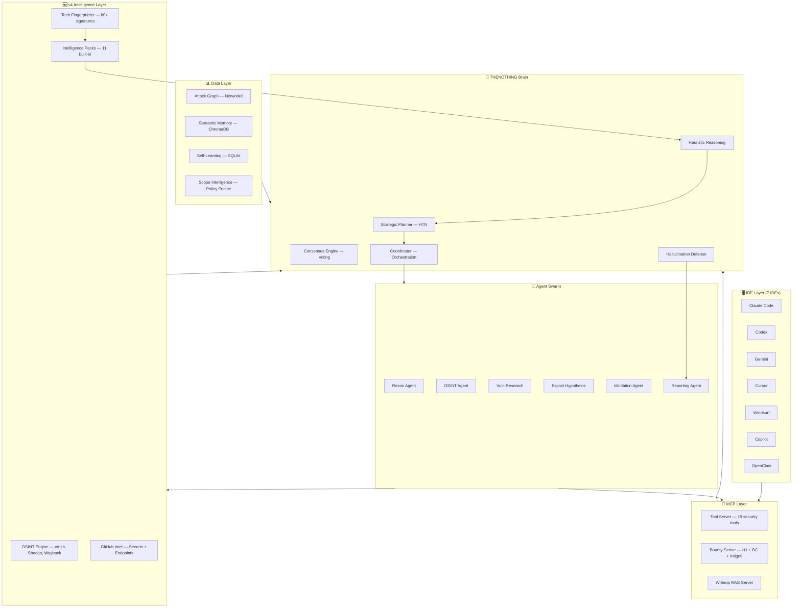

<p align="center">
  
  
  
  
  
  
  
</p>

<h1 align="center">👁️‍🗨️ THENOTHING</h1>
<h3 align="center">Autonomous AI Security Intelligence & Orchestration Platform</h3>

<p align="center">
  <b>OSINT intelligence · Tech fingerprinting · Intelligence packs · Heuristic reasoning · Hallucination defense · Multi-agent swarm · Attack graphs · Semantic memory · 7 IDE support</b>
</p>

<p align="center">
  The most advanced open-source autonomous security orchestration platform.<br/>
  THENOTHING deploys intelligent agent swarms that plan, hunt, validate, and report — with zero false positives.
</p>

---

## 🆕 What's New in v4.0

| Module | Description |
|--------|-------------|
| 🔍 **OSINT Intelligence** | Passive recon via crt.sh, Shodan, Censys, SecurityTrails, Wayback Machine, DNS/WHOIS |
| 🐙 **GitHub Intelligence** | Secret scanning (20+ patterns), endpoint extraction, employee-to-infra correlation |
| 🔬 **Tech Fingerprinting** | Wappalyzer-style detection — 80+ signatures across headers, HTML, cookies, meta tags |
| 📦 **Intelligence Packs** | 11 hot-loadable packs: WordPress, Next.js, GraphQL, AWS, Laravel, OAuth, K8s, Firebase, Supabase, Cloudflare, API Security |
| 🧠 **Heuristic Reasoning** | Bayesian vulnerability likelihood with tech-specific boosters for 15+ frameworks |
| 🛡️ **Hallucination Defense** | Evidence-first verification, contradiction detection, confidence scoring — blocks unsupported claims |
| 🕵️ **OSINT Swarm Agent** | Stateless agent handling 8 OSINT task types in the multi-agent architecture |
| 🔀 **Execution Graph Engine** | DAG-based workflows with branching, conditional, recursive expansion, rollback, snapshots |
| 🌐 **Browser Intelligence** | Playwright-based SPA crawling, authenticated flows, token/JWT/cookie extraction, CSRF analysis |
| 📜 **JavaScript Intelligence** | Endpoint extraction, source-map analysis, 15+ secret patterns, framework detection, webpack chunks |
| 🔐 **API Security Agent** | BOLA/BFLA heuristics, JWT analysis, mass-assignment, CORS, rate-limit, OpenAPI parsing |
| ☁️ **Cloud Security Agent** | AWS/Azure/GCP/K8s/Docker exposure, SSRF-to-metadata payloads, S3 permission checks, CI/CD analysis |
| 🔗 **Secret Lineage Tracker** | Credential propagation mapping: origin → pipeline → deployment → runtime → exfiltration |
| 🎯 **Universal Skills Engine** | 79 skills across 14 categories (OWASP Top 10, API Top 10, Web, Auth, Cloud, K8s, AI/LLM, CI/CD, OSINT) with 83 exploit hypotheses |
| 🌍 **World Model Engine** | Cognitive target modeling — entity-relation graphs, trust boundaries, auth flow inference, attack surface computation |
| 💣 **Payload Generation Engine** | Autonomous payload mutation with WAF profiling, 9 bypass strategies, adaptive response-based evolution |
| ⚔️ **Multi-Agent Debate System** | Adversarial 4-agent reasoning (Hypothesis/Skeptic/Validator/Risk) — hallucination defense + self-critique |
| 🚀 **New Workflows** | `osint_recon` (OSINT → fingerprint → targeted scan) and `full_auto` (complete autonomous pipeline) |

---

## ⚡ One-Command Install

```bash
# Linux / macOS
git clone https://github.com/thenothing0/THENOTHING.git && cd THENOTHING && ./setup.sh

# Windows (PowerShell)
git clone https://github.com/thenothing0/THENOTHING.git; cd THENOTHING; .\setup.ps1

# Docker (production)
docker compose up -d
```

---

## 🏗️ Architecture



---

## 🚀 Quick Start

### Prerequisites
```bash
# Python 3.10+
pip install rich aiohttp

# Security tools (Go 1.20+ required)
go install -v github.com/projectdiscovery/subfinder/v2/cmd/subfinder@latest
go install -v github.com/projectdiscovery/httpx/cmd/httpx@latest
go install -v github.com/projectdiscovery/nuclei/v3/cmd/nuclei@latest
go install -v github.com/projectdiscovery/katana/cmd/katana@latest
go install -v github.com/ffuf/ffuf/v2@latest
```

### CLI Mode
```bash
# Check which tools are installed
python -m hydra.main --check-tools

# List available workflows
python -m hydra.main --list-workflows

# ── v4 Workflows ──────────────────────────
# OSINT-first recon (passive intel → fingerprint → targeted scan)
python -m hydra.main -t example.com -w osint_recon

# Full autonomous (OSINT → fingerprint → heuristic scan → crawl → fuzz → validate)
python -m hydra.main -t example.com -w full_auto

# With scope enforcement from HackerOne/Bugcrowd
python -m hydra.main -t example.com -w full_auto --scope-url https://hackerone.com/example

# ── Classic Workflows ─────────────────────
# Quick recon (subdomains → probe → tech → nuclei)
python -m hydra.main -t example.com -w quick_recon

# Full bug bounty assessment
python -m hydra.main -t example.com -w full_bounty

# API-focused scan
python -m hydra.main -t api.example.com -w api_only

# Black-box aggressive recon
python -m hydra.main -t example.com -w blackbox
```

All outputs saved to `output/<target>/` → `recon/`, `osint/`, `scans/`, `reports/`, `evidence/`, `attack_graph/`, `logs/`

### Claude Code Mode
```bash
claude  # open Claude Code in the project folder

# Slash commands:
/recon example.com           # Full reconnaissance
/hunt example.com            # Autonomous vulnerability hunting
/autopilot example.com       # Full autonomous mode
/chain                       # Build exploit chains from findings
/report                      # Generate submission-ready report
/scope hackerone tesla       # Load scope from platform
```

---

## 📦 Project Structure

```
hydra/
├── main.py                        # 🚀 Entry Point (v4 engine)
├── config.py                      # ⚙️  Environment-driven Config
├── osint/                         # 🔍 OSINT Intelligence Layer
│   ├── __init__.py                #     crt.sh, Shodan, Censys, DNS, Wayback
│   └── github_intel.py            #     GitHub secret scanning + endpoint extraction
├── fingerprint/                   # 🔬 Technology Fingerprinting
│   └── __init__.py                #     80+ Wappalyzer-style signatures
├── packs/                         # 📦 Intelligence Packs
│   └── __init__.py                #     11 built-in packs, hot-loadable
├── heuristics/                    # 🧠 Heuristic Reasoning
│   └── __init__.py                #     Bayesian vulnerability likelihood
├── hallucination/                 # 🛡️ Hallucination Defense
│   └── __init__.py                #     Evidence-first verification
├── planner/                       # 🧠 Strategic Planner + HTN
├── swarm/                         # 🐝 Agent Swarm
│   ├── coordinator.py             #     Scan orchestration
│   ├── agent_factory.py           #     Dynamic agent spawning
│   ├── osint_agent.py             #     OSINT Intelligence Agent
│   └── specialized/               #     API, Web3, Mobile, Cloud agents
├── scope/                         # 🎯 Scope Intelligence Layer
├── graph/                         # 📊 Attack Graph + Scoring
├── memory/                        # 💾 Memory Bus + Semantic Memory
├── mcp/                           # 🔧 MCP Tool Server (19 tools)
├── consensus/                     # 🤝 Multi-Agent Consensus
├── validation/                    # ✅ Evidence-Based Validation
├── execution_graph/               # 🔀 DAG-Based Execution Engine (NEW)
├── browser/                       # 🌐 Browser Intelligence — Playwright (NEW)
├── js_intel/                      # 📜 JavaScript Intelligence Engine (NEW)
├── api_security/                  # 🔐 API Security Agent (NEW)
├── cloud_security/                # ☁️  Cloud Security Agent (NEW)
├── secret_lineage/                # 🔗 Secret Lineage Tracker (NEW)
├── skills/                        # 🎯 Universal Skills Engine (NEW)
│   ├── __init__.py                #     Skill registry, composer, evolver
│   └── library.py                 #     79 pre-built skills, 14 categories
├── world_model/                   # 🌍 Cognitive Target Modeling (NEW)
├── payload_engine/                # 💣 Autonomous Payload Generation (NEW)
├── debate/                        # ⚔️  Multi-Agent Debate System (NEW)
├── learning/                      # 🧠 Self-Learning Engine
├── sandbox/                       # 🔒 Security Sandbox
├── dashboard/                     # 📈 Real-Time Web Dashboard
├── queue/                         # 📦 Distributed Queue
├── hunt/                          # 🎯 Autonomous Hunt Loops
├── chains/                        # ⛓️  Exploit Chain Builder
├── reporting/                     # 📄 Advanced Reports
├── cost/                          # 💰 Cost & Token Management
├── ai/                            # 🤖 Multi-LLM Router
├── recovery/                      # 🔄 Workflow Recovery
├── observability/                 # 📊 Prometheus + Grafana
└── plugins/                       # 🔌 Plugin System
```

---

## 🧩 v4 Intelligence Layer

### 🔍 OSINT Intelligence Engine
Passive reconnaissance with zero active scanning:
- **crt.sh** — Certificate transparency subdomain discovery
- **Shodan** — Open ports, CVEs, SSL certificates
- **Censys** — Host and service discovery
- **SecurityTrails** — DNS history, WHOIS, subdomain enumeration
- **Wayback Machine** — Historical URL discovery with endpoint categorization
- **DNS/WHOIS** — IP resolution, ASN attribution, reverse DNS

### 🐙 GitHub Intelligence
Employee-to-infrastructure correlation chains:
- **20+ secret patterns** — AWS keys, GitHub tokens, Slack webhooks, JWTs, private keys, database URLs
- **Endpoint extraction** — API routes, GraphQL endpoints, webhooks from source code
- **Internal domain discovery** — staging/dev/internal subdomains leaked in repos
- **Employee correlation** — `employee → repository → secret → infrastructure → attack path`

### 🔬 Technology Fingerprinting
Wappalyzer-style detection with 80+ signatures:
- **Headers** — Server, X-Powered-By, CDN, WAF detection
- **HTML** — CMS, JS frameworks, analytics, auth systems
- **Cookies** — Framework detection (PHP, Rails, Django, Express)
- **Auto-triggers** intelligence pack activation based on detected stack

### 📦 Intelligence Packs (11 Built-in)

| Pack | Exploit Hypotheses | Key Checks |
|------|-------------------|------------|
| **WordPress** | User enum, XML-RPC brute, plugin vulns | xmlrpc, wp-json, debug.log |
| **Next.js** | SSRF, auth bypass, env exposure | `__NEXT_DATA__`, API routes, source maps |
| **GraphQL** | IDOR, injection, DoS | Introspection, GraphiQL, depth limits |
| **AWS** | SSRF to metadata, S3 misconfig | 169.254.169.254, bucket perms |
| **Laravel** | Debug RCE, deserialization | .env, Telescope, Ignition |
| **OAuth** | Redirect steal, state bypass, scope escalation | redirect_uri, state param |
| **Kubernetes** | Unauth API, dashboard exposure | /api/v1, privileged pods |
| **API Security** | BOLA/IDOR, mass assignment, rate limit bypass | CORS, Swagger, auth endpoints |
| **Firebase** | Unauth read/write | .json endpoint, storage bucket |
| **Supabase** | RLS bypass, anon key exposure | PostgREST, service role key |
| **Cloudflare** | Origin IP leak, WAF bypass | DNS history, direct origin |

### 🧠 Heuristic Reasoning Engine
Bayesian vulnerability likelihood estimation:
- **Prior probabilities** from real-world bug bounty data
- **Technology boosters** — WordPress boosts XSS/SQLi/file upload; GraphQL boosts IDOR 1.8×
- **Adaptive decisions** — expand investigation on critical findings, reduce noise on low-value targets
- **WAF-aware scanning** — automatic stealth mode with delay and header randomization

### 🛡️ Hallucination Defense
No unsupported AI-generated claim appears in reports:
- **Evidence presence check** — requires tool output, matched_at, or registered evidence
- **Hallucination indicator scanning** — detects vague language ("likely", "possibly")
- **Contradiction detection** — flags "critical" + "low risk" in same finding
- **Multi-agent consensus** — aggregates verification across agents

---

## 🧩 Core Components

### 🧠 Strategic Planner (HTN)
Goal-driven autonomous reasoning using Hierarchical Task Network decomposition:
- Decomposes high-level goals into adaptive workflows
- Recursively re-plans based on findings
- Dynamically activates intelligence packs based on detected technologies
- Accepts scope intelligence directives (`DISABLE:`, `RATE_LIMIT:`, `FOCUS_API:`)

### 🐝 Agent Swarm + Dynamic Spawning
50+ specialized agents with on-the-fly spawning:
- **Core**: Recon, OSINT, Vuln Research, Exploit Hypothesis, Validation, Reporting
- **Specialized**: API, Web3, Mobile, Cloud — spawned dynamically
- **OSINT Agent**: 8 task types — full OSINT, cert transparency, DNS intel, Wayback, Shodan, GitHub, employee intel, attack surface mapping

### 📊 Attack Graph Intelligence
NetworkX-based graph with risk propagation:
- CVSS-weighted risk scores, blast radius estimation
- Multi-hop privilege escalation detection
- Visualization: DOT, JSON, Cytoscape, interactive HTML export

### 🤝 Multi-Agent Consensus
Weighted voting eliminates false positives (<2% FP rate):
- Agent-type expertise weighting (validation > exploit > vuln_research > recon)
- Contradiction detection between agents

### 🎯 Scope Intelligence Layer
Mandatory pre-execution scope analysis:
- Platform adapters: **HackerOne**, **Bugcrowd**, **Intigriti**, Custom
- `--scope-url` CLI flag for automatic scope loading
- MCP layer blocks out-of-scope scans at every level

### ✅ Validation-First Reporting
No finding reported unless all checks pass:
- Evidence must exist (HTTP artifacts, screenshots, matched patterns)
- Reproduction path documented, hallucination defense check passes
- Rejected findings saved separately for audit

### 🔀 Execution Graph Engine
DAG-based workflow execution replacing linear pipelines:
- **Branching execution** — parallel recon paths, speculative execution
- **Conditional execution** — nodes run only when parent output matches conditions
- **Recursive expansion** — nodes dynamically spawn sub-graphs at runtime
- **Rollback edges** — trigger cleanup on failure
- **Snapshot & recovery** — checkpoint/restore mid-execution
- Pre-built graphs: `osint_recon` (7 nodes), `full_auto` (14 nodes, 15 edges)

### 🌐 Browser Intelligence Engine
Playwright-based SPA crawling and authenticated automation:
- **Authenticated crawling** — cookie injection, session replay
- **Token extraction** — JWT, Bearer, API keys from HTML, localStorage, sessionStorage
- **Form analysis** — CSRF detection, input discovery
- **Cookie security** — missing HttpOnly/Secure/SameSite flags
- **Technology detection** — React, Vue, Next.js, Angular, Svelte, Remix
- **Screenshot evidence** — full-page captures for every analyzed page

### 📜 JavaScript Intelligence Engine
Deep JS bundle analysis with 15+ secret patterns:
- **Endpoint extraction** — fetch/axios calls, route definitions, dynamic imports
- **Secret scanning** — AWS keys, Stripe keys, GitHub tokens, database URLs, JWTs, OAuth secrets
- **Framework detection** — React, Vue, Angular, Next.js, Nuxt, Svelte, Webpack, Vite
- **Source-map analysis** — discover original source code
- **Internal domain leakage** — staging/dev/admin domains in bundles
- **Hidden route discovery** — React Router paths, client-side navigation

### 🔐 API Security Agent
Dedicated API vulnerability intelligence:
- **BOLA/IDOR heuristics** — auto-detect ID-parameterized endpoints
- **JWT analysis** — algorithm none, weak HS256, privilege claims, missing expiry
- **Mass-assignment detection** — flag PUT/PATCH endpoints accepting dangerous fields
- **CORS analysis** — wildcard origin + credentials, reflected origin
- **Rate-limit intelligence** — detect missing throttling headers
- **OpenAPI parsing** — extract all endpoints from Swagger/OpenAPI specs

### ☁️ Cloud Security Agent
Multi-cloud exposure detection (AWS, Azure, GCP, K8s, Docker):
- **AWS** — S3 buckets, access keys, EC2 metadata, Lambda, Cognito, CloudFront
- **Azure** — Blob storage, App Service, Key Vault, Cosmos DB
- **GCP** — Storage, Firebase, Cloud Functions, Cloud Run
- **Kubernetes** — API server, dashboard, etcd, kubelet port exposure
- **Docker** — socket exposure, registry discovery
- **CI/CD** — GitHub Actions, GitLab CI, Jenkins, Terraform state
- **SSRF payloads** — pre-built metadata service payloads for all providers

### 🔗 Secret Lineage Tracker
Full credential lifecycle tracking:
- **Chain mapping**: `origin → storage → pipeline → deployment → runtime → exfiltration`
- **Auto-inference** — builds chains from findings (GitHub → CI → Deploy → Runtime)
- **Risk scoring** — based on propagation depth, secret type, exposure stages
- **Blast radius** — counts affected systems per secret
- **Remediation generation** — step-by-step rotation and cleanup guidance

### 🎯 Universal Skills Engine
79 pre-built autonomous vulnerability skills across 14 categories:

| Category | Skills | Coverage |
|----------|--------|----------|
| **Web** | 18 | XSS (reflected/stored/DOM/mutation), SQLi (error/blind/time), SSRF, SSTI, XXE, CSRF, LFI, deserialization, request smuggling, cache poisoning, race conditions |
| **Auth** | 9 | JWT attacks, OAuth abuse, session fixation/hijacking, MFA bypass, IDOR, privilege escalation, account takeover |
| **API** | 8 | BOLA, BFLA, mass assignment, rate limit, GraphQL introspection/depth/IDOR |
| **Cloud** | 6 | S3 exposure, IAM escalation, metadata abuse, Lambda exposure, Azure/GCP abuse |
| **Kubernetes** | 4 | Dashboard exposure, RBAC bypass, container escape, Docker socket |
| **Business Logic** | 5 | Payment abuse, coupon abuse, checkout bypass, workflow state, trust boundaries |
| **AI/LLM** | 5 | Prompt injection (direct/indirect), RAG poisoning, tool abuse, context hijacking |
| **CI/CD** | 6 | GitHub Actions, GitLab CI, Jenkins, dependency confusion, artifact poisoning, Terraform |
| **Frontend** | 6 | DOM XSS, CSP bypass, postMessage, service workers, client-side auth, JS secrets |
| **Mobile** | 6 | Android/iOS storage, cert pinning, API key extraction, deep links, Electron |
| **OSINT** | 6 | Subdomain takeover, ASN mapping, GitHub leaks, employee intel, DNS history, CT logs |

Each skill includes: exploit hypotheses, payloads, validation rules, chain links, and learning metrics.
**Skill Composer** merges skills into hybrid attack workflows. **Skill Evolver** tracks success rates and adjusts confidence.

### 🌍 World Model Engine
Cognitive target modeling that understands systems, not just scans them:
- **Entity graph** — applications, APIs, services, roles, permissions, sessions, tokens, cloud resources
- **Relationship mapping** — authenticates, authorizes, trusts, depends_on, escalates_to, exposes
- **Trust boundaries** — define security zones and detect cross-boundary violations
- **Auth flow inference** — auto-detect endpoints missing authentication or authorization
- **Escalation path discovery** — BFS through privilege hierarchies (User → Admin paths)
- **Attack surface computation** — total endpoints, unauth endpoints, high-value targets, weakness indicators

### 💣 Autonomous Payload Engine
Context-aware payload generation with adaptive mutation:
- **Pre-built templates** — 20 XSS, 14 SQLi, 14 SSRF, 10 SSTI, polyglots
- **9 mutation strategies** — URL encode, double encode, unicode, hex, case swap, null byte, comment inject, whitespace, concat
- **WAF/filter profiling** — infer blocking rules from response analysis (Cloudflare, Akamai, ModSecurity)
- **Adaptive generation** — select mutations based on detected filter profile
- **Bypass strategy suggestions** — auto-recommend evasion techniques per WAF
- **Learning loop** — promote successful payloads, demote blocked ones

### ⚔️ Multi-Agent Debate System
Adversarial reasoning ensures zero hallucinated findings:
- **Hypothesis Agent** — proposes vulnerabilities, evaluates evidence strength + exploit plausibility
- **Skeptic Agent** — detects hallucination indicators ("likely", "possibly"), finds contradictions, checks evidence sufficiency
- **Validation Agent** — verifies HTTP evidence, reproduction steps, severity justification (4 validation checks)
- **Risk Agent** — scores severity × evidence quality × exploitability × blast radius
- **Weighted verdict** — Validator (35%), Skeptic (25%), Hypothesis (20%), Risk (20%)
- **Self-critique** — findings must survive adversarial scrutiny before entering reports
- Proven: rejects weak/hallucinated findings (confidence 0.04), accepts strong evidence-backed ones

---

## 📋 Workflow Templates

| Workflow | Duration | Description |
|----------|----------|-------------|
| `osint_recon` | ~10 min | OSINT → fingerprint → pack activation → heuristic-guided scan |
| `full_auto` | ~40 min | Full autonomous: OSINT → fingerprint → crawl → deep scan → validate |
| `quick_recon` | ~5 min | Fast subdomain + tech + nuclei scan |
| `full_bounty` | ~30 min | Complete assessment with exploit chains |
| `api_only` | ~15 min | API endpoint discovery + auth testing |
| `blackbox` | ~25 min | Black-box testing without source code |
| `web3_audit` | ~20 min | Smart contract vulnerability analysis |
| `code_review` | ~15 min | Source code security review |

---

## ⚙️ Configuration

| Variable | Default | Description |
|----------|---------|-------------|
| `OPENAI_API_KEY` | | OpenAI API key |
| `ANTHROPIC_API_KEY` | | Anthropic API key |
| `OLLAMA_URL` | `http://127.0.0.1:11434` | Ollama endpoint |
| `SHODAN_API_KEY` | | Shodan API key (OSINT) |
| `GITHUB_TOKEN` | | GitHub token (OSINT) |
| `ST_API_KEY` | | SecurityTrails API key |
| `CENSYS_ID` / `CENSYS_SECRET` | | Censys credentials |
| `REDIS_HOST` | `127.0.0.1` | Redis host |
| `HYDRA_MONTHLY_CAP` | `100` | Monthly AI budget (USD) |
| `HYDRA_RATE_LIMIT` | `50` | Max requests/second |
| `HYDRA_SANDBOX` | `true` | Enable sandbox |
| `HYDRA_DASHBOARD` | `true` | Enable dashboard |
| `HYDRA_QUEUE_MODE` | `local` | `local` or `distributed` |

> **Note**: OSINT API keys are optional. crt.sh, Wayback Machine, and DNS work without any keys.

---

## 🛡️ Safety Rules

1. **No scan without scope validation** — MCP layer blocks every out-of-scope target
2. **No finding without evidence** — validation-first filter rejects unsupported findings
3. **No hallucinated reports** — hallucination defense blocks vague/contradictory claims
4. **No uncontrolled execution** — all tools run through security sandbox + scope policy engine
5. **No budget overrun** — automatic model downgrading when thresholds hit
6. **No data loss** — workflow checkpointing ensures recovery from failures
7. **No unreproducible work** — all outputs auto-saved with timestamps and content hashes

---

## 🐋 Deployment

### Docker Compose (Recommended)
```bash
docker compose up -d
# Services: thenothing, redis, chromadb, prometheus, grafana
# Dashboard: http://localhost:8080
```

### Kubernetes (Production)
```bash
kubectl apply -f k8s/manifests/
```

### Standalone
```bash
pip install -r requirements.txt
python -m hydra.main -t example.com -w full_auto
```

---

## 🧪 Tests

```bash
python -m pytest tests/ -v --tb=short
# 18 tests: consensus, planner, scope — all passing
```

---

## ⚠️ Legal Disclaimer

**THENOTHING is designed for authorized security testing only.**

- Only test targets within approved bug bounty program scopes
- Always verify scope before scanning
- The scope enforcement engine will block out-of-scope targets, but **you are ultimately responsible**
- Unauthorized scanning is illegal and unethical

---

## 🤝 Contributing

See [CONTRIBUTING.md](CONTRIBUTING.md) for guidelines. We welcome:
- New intelligence packs (add to `hydra/packs/`)
- OSINT data source integrations
- Tool integrations (add to `TOOL_REGISTRY`)
- Bug bounty platform adapters
- Fingerprint signatures

---

## 📜 License

MIT License — see [LICENSE](LICENSE) for details.

---

<p align="center">
  <b>Built for bug bounty hunters, by bug bounty hunters.</b><br/>
  <sub>THENOTHING — Autonomous AI Security Intelligence & Orchestration Platform</sub>
</p>
