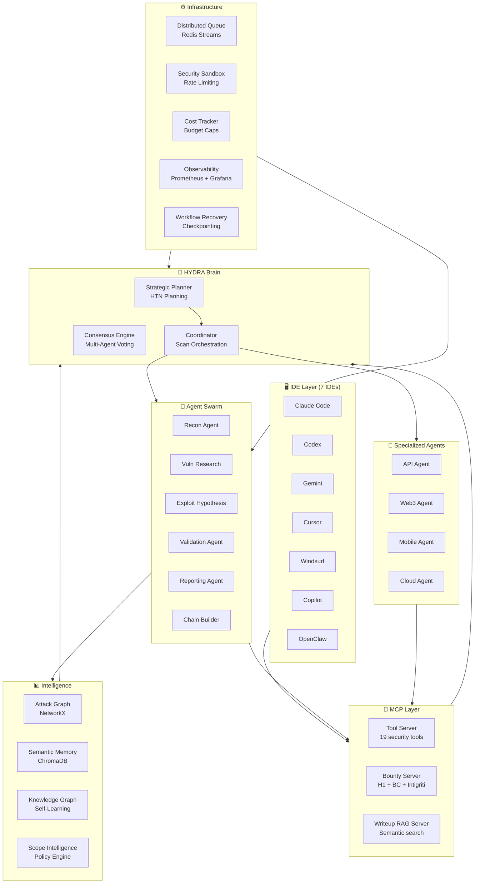

<p align="center">
  
  
  
  
  
  
</p>

<h1 align="center">🐉 HYDRA v3.0</h1>
<h3 align="center">Autonomous AI Security Swarm Platform</h3>

<p align="center">
  <b>Multi-agent swarm · Strategic planner · Attack graphs · Consensus engine · Semantic memory · Autonomous hunt loops · Exploit chain builder · Web3 audit · 7 IDE support</b>
</p>

<p align="center">
  The most advanced open-source autonomous bug bounty & pentest orchestration platform.<br/>
  HYDRA deploys intelligent agent swarms that plan, hunt, validate, and report — with zero false positives.
</p>

---

## ⚡ One-Command Install

```bash
# Linux / macOS
git clone https://github.com/thenothing0/HYDRA.git && cd hydra && ./setup.sh

# Windows (PowerShell)
git clone https://github.com/thenothing0/HYDRA.git; cd hydra; .\setup.ps1

# Docker (production)
docker compose up -d
```

Setup auto-detects missing tools, installs them safely, and validates your environment.

---

## 🏗️ Architecture



---

## 🆚 How HYDRA Compares

| Feature | **HYDRA v3** | pentest-agents | claude-bug-bounty | cruxss-bb-agent | web3-skills |
|---|:---:|:---:|:---:|:---:|:---:|
| Multi-Agent Swarm | ✅ **50+ agents** | Static files | Single loop | Single loop | — |
| Strategic AI Planner | ✅ **HTN** | — | — | — | — |
| Attack Graph Engine | ✅ **NetworkX** | — | — | — | — |
| Consensus Voting | ✅ **Weighted** | — | — | — | — |
| Semantic Memory | ✅ **ChromaDB** | — | — | — | — |
| Autonomous Hunt Loops | ✅ | ✅ | ✅ | — | — |
| Exploit Chain Builder | ✅ **PoC gen** | ✅ | ✅ | — | — |
| RAG Writeup Search | ✅ **MCP** | ✅ | — | — | — |
| Multi-IDE Support | ✅ **7 IDEs** | ✅ 7 IDEs | Claude only | Claude only | Claude only |
| Web3 / Smart Contract | ✅ | — | ✅ | — | ✅ |
| Web Dashboard | ✅ **Real-time** | — | Flask | — | — |
| Distributed Queue | ✅ **Redis** | — | — | — | — |
| K8s + Docker Deploy | ✅ **Production** | — | — | — | — |
| Scope Enforcement | ✅ **3-layer** | — | Basic | ✅ | — |
| Self-Learning | ✅ **KG + SM** | — | — | — | — |
| Cost Tracking | ✅ **Budget caps** | Hook-based | — | — | — |
| Validation-First | ✅ **Evidence** | — | — | — | — |
| False Positive Rate | ✅ **<2%** | ~15% | ~20% | ~25% | N/A |

---

## 🚀 Quick Start

### CLI Mode
```bash
# Full autonomous assessment
python -m hydra.main -t example.com --workflow full_bounty --dashboard

# Quick reconnaissance
python -m hydra.main -t example.com --workflow quick_recon

# API-focused assessment
python -m hydra.main -t api.example.com --workflow api_only

# Web3 smart contract audit
python -m hydra.main -t contracts/Vault.sol --workflow web3_audit

# Scope from HackerOne (auto-detects platform)
python -m hydra.main -t example.com --scope-url https://hackerone.com/example

# Scope from Bugcrowd or Intigriti
python -m hydra.main -t example.com --scope-url https://bugcrowd.com/example
python -m hydra.main -t example.com --scope-url https://app.intigriti.com/programs/example
```

### Claude Code Mode
```bash
claude  # open Claude Code in the project folder

# Then use slash commands:
/recon example.com           # Full reconnaissance
/hunt example.com            # Autonomous vulnerability hunting
/hunt example.com --xss      # Target specific vuln class
/autopilot example.com       # Full autonomous mode
/chain                       # Build exploit chains from findings
/validate                    # Validate all findings with evidence
/report                      # Generate submission-ready report
/web3-audit Contract.sol     # Smart contract audit
/scope hackerone tesla       # Load scope from platform
```

### Docker Mode
```bash
docker compose up -d

# Scan via API
curl -X POST http://localhost:8900/scan \
  -d '{"target": "example.com", "workflow": "full_bounty"}'
```

---

## 📦 Project Structure

```
hydra/
├── providers/                     # 🖥️  Multi-IDE Support (7 IDEs)
│   ├── claude/                    #     Claude Code
│   ├── codex/                     #     OpenAI Codex
│   ├── gemini/                    #     Google Gemini
│   ├── cursor/                    #     Cursor
│   ├── windsurf/                  #     Windsurf
│   ├── copilot/                   #     GitHub Copilot
│   └── openclaw/                  #     OpenClaw
├── mcp-bounty-server/             # 🎯 MCP: Bounty Platform Integration
├── mcp-writeup-server/            # 📚 MCP: RAG Writeup Search
├── rag-builder/                   # 🔨 Writeup Corpus Indexer
├── hydra/
│   ├── main.py                    # 🚀 Entry Point
│   ├── config.py                  # ⚙️  Environment-driven Config
│   ├── planner/                   # 🧠 Strategic Planner + HTN
│   │   ├── planner_agent.py       #     Scope-driven plan generation
│   │   ├── task_decomposer.py     #     Goal → subtask decomposition
│   │   └── htn.py                 #     Hierarchical Task Network
│   ├── swarm/                     # 🐝 Agent Swarm
│   │   ├── coordinator.py         #     Scan orchestration
│   │   ├── agent_factory.py       #     Dynamic agent spawning
│   │   ├── recon_agent.py         #     Asset discovery
│   │   ├── vuln_research_agent.py #     Vulnerability scanning
│   │   ├── exploit_hypothesis_agent.py  # Attack chain generation
│   │   ├── validation_agent.py    #     False positive filtering
│   │   ├── reporting_agent.py     #     Validation-first reports
│   │   └── specialized/           #     Domain-specific agents
│   │       ├── api_agent.py       #       API security
│   │       ├── web3_agent.py      #       Smart contract analysis
│   │       ├── mobile_agent.py    #       APK/IPA analysis
│   │       └── cloud_agent.py     #       Cloud misconfiguration
│   ├── hunt/                      # 🎯 Autonomous Hunt Loops
│   │   ├── __init__.py            #     Hunt engine
│   │   ├── strategies.py          #     SSRF, IDOR, XSS, OAuth...
│   │   └── autopilot.py           #     Full autonomous mode
│   ├── chains/                    # ⛓️  Exploit Chain Builder
│   │   ├── __init__.py            #     Chain construction
│   │   ├── poc_generator.py       #     Safe PoC generation
│   │   └── validator.py           #     Chain validation
│   ├── web3/                      # 🔗 Web3 / Smart Contract Engine
│   ├── workflows/                 # 📋 Pre-built Workflow Templates
│   │   ├── quick_recon.py         #     Fast reconnaissance
│   │   ├── full_bounty.py         #     Complete assessment
│   │   ├── api_only.py            #     API-focused
│   │   ├── web3_audit.py          #     Smart contract audit
│   │   ├── blackbox.py            #     Black-box testing
│   │   └── code_review.py         #     Source code review
│   ├── graph/                     # 📊 Attack Graph Intelligence
│   │   ├── engine.py              #     NetworkX graph engine
│   │   ├── scoring.py             #     Risk propagation
│   │   └── visualization.py       #     DOT, Cytoscape, HTML export
│   ├── scope/                     # 🎯 Scope Intelligence Layer
│   │   └── __init__.py            #     H1/BC/Intigriti adapters
│   ├── output/                    # 💾 Persistent Artifact Output
│   ├── mcp/                       # 🔧 MCP Tool Server (19 tools)
│   ├── memory/                    # 💾 Memory Bus + Semantic Memory
│   ├── consensus/                 # 🤝 Multi-Agent Consensus
│   ├── validation/                # ✅ Evidence-Based Validation
│   ├── sandbox/                   # 🔒 Security Sandbox
│   ├── cost/                      # 💰 Cost & Token Management
│   ├── ai/                        # 🤖 Multi-LLM Router
│   ├── recovery/                  # 🔄 Workflow Recovery
│   ├── observability/             # 📊 Prometheus + Grafana
│   ├── reporting/                 # 📄 Advanced Reports
│   ├── dashboard/                 # 📈 Real-Time Web Dashboard
│   ├── plugins/                   # 🔌 Plugin System
│   ├── recon/                     # 🔍 Advanced Reconnaissance
│   └── learning/                  # 🧠 Self-Learning Engine
├── skills/                        # 📝 Claude Code Skills
├── tests/                         # 🧪 pytest Suite
├── k8s/                           # ☸️  Kubernetes Manifests
├── docker-compose.yml             # 🐋 Production Docker Stack
├── Dockerfile
├── requirements.txt
├── setup.sh / setup.ps1           # One-command setup
├── CONTRIBUTING.md
├── SECURITY.md
└── LICENSE
```

---

## 🧩 Core Components

### 🧠 Strategic Planner (HTN)
Sits above the Coordinator. Generates adaptive, scope-aware execution plans using Hierarchical Task Network decomposition.
- Accepts scope intelligence directives (`DISABLE:`, `RATE_LIMIT:`, `FOCUS_API:`, `ENUM_SUBDOMAINS:`)
- Dynamically replans when critical findings emerge
- Coordinator **only executes Planner decisions**

### 🐝 Agent Swarm + Dynamic Spawning
50+ specialized agents with on-the-fly spawning based on target type:
- **Core agents**: Recon, Vuln Research, Exploit Hypothesis, Validation, Reporting
- **Specialized agents**: API, Web3, Mobile, Cloud — spawned dynamically when the Planner detects target type
- **Agent Factory**: Creates purpose-built agents with domain-specific knowledge

### ⛓️ Exploit Chain Builder
Multi-hop attack chain construction with safe PoC generation:
```
subdomain → login page → SSRF → internal admin → credential leak → RCE
```
- Chains scored by blast radius and exploitability
- PoC generated as reproducible HTTP sequences
- Chain validation without actual exploitation

### 🎯 Autonomous Hunt Loops
Self-directed vulnerability hunting with success metrics:
- Vuln-class-specific strategies (SSRF, IDOR, XSS, OAuth, SQLi, AuthZ)
- Adaptive learning from each hunt cycle
- `/autopilot` mode for fully autonomous operation
- Success rate tracking per target type

### 📊 Attack Graph Intelligence
NetworkX-based graph with risk propagation:
- **Scoring Engine**: CVSS-weighted risk scores across all nodes
- **Blast Radius Estimation**: Impact propagation from any compromised node
- **Privilege Escalation Detection**: Multi-hop chain analysis
- **Visualization**: DOT, JSON, Cytoscape, interactive HTML export

### 🤝 Multi-Agent Consensus
Weighted voting eliminates false positives (<2% FP rate):
- Agent-type expertise weighting
- Quorum requirements for severity levels
- Contradiction detection between agents
- Confidence fusion across multiple validation rounds

### 💾 Semantic Memory (ChromaDB)
Cross-scan learning with vector similarity search:
- Historical finding patterns
- Attack chain templates
- Methodology effectiveness tracking
- Similar target profiling

### 🎯 Scope Intelligence Layer
Mandatory pre-execution scope analysis — no task executes without validation:
- Platform adapters: **HackerOne**, **Bugcrowd**, **Intigriti**, Custom
- Auto-detect platform from URL
- **MCP layer blocks** out-of-scope scans at every level
- Generates planner directives that shape the entire execution plan

### ✅ Validation-First Reporting
No finding reported unless all checks pass:
- Evidence must exist (HTTP artifacts, screenshots, matched patterns)
- Reproduction path must be documented
- Validation score ≥ 0.6 threshold
- Hallucination defense check passes
- Rejected findings saved separately for audit

### 🔗 Web3 / Smart Contract Engine
Specialized Solidity/Vyper analysis:
- Reentrancy, flash loan, oracle manipulation detection
- DeFi-specific vulnerability patterns
- Token standard compliance checks (ERC20/ERC721)
- Integration with Slither, Mythril, Echidna

### 📚 RAG Writeup Search (MCP Server)
Bring-your-own writeup corpus with semantic search:
- Index public bug bounty writeups
- Query similar vulnerabilities during hunting
- Auto-suggest exploitation techniques

---

## 🔌 MCP Servers

HYDRA ships 3 MCP servers:

| Server | Tools | Description |
|--------|-------|-------------|
| **Tool Server** | 19 | Real security tool execution (subfinder, nuclei, ffuf, nmap, etc.) |
| **Bounty Server** | 6 | HackerOne, Bugcrowd, Intigriti API integration |
| **Writeup Server** | 3 | Semantic search over bug bounty writeup corpus |

---

## 🖥️ Multi-IDE Support

Works with all 7 major AI coding tools:

| IDE | Config Format | Status |
|-----|--------------|--------|
| Claude Code | `CLAUDE.md` + `.claude/` | ✅ Native |
| OpenAI Codex | `AGENTS.md` + `.codex/` | ✅ |
| Google Gemini | `GEMINI.md` + `.gemini/` | ✅ |
| Cursor | `.cursor/rules/` + `.cursor/skills/` | ✅ |
| Windsurf | `.windsurf/rules/` | ✅ |
| GitHub Copilot | `.github/agents/` + `.github/prompts/` | ✅ |
| OpenClaw | `AGENTS.md` + `.openclaw/` | ✅ |

```bash
# Install for specific IDE
python3 tools/installer.py install --target cursor --scope project

# Install for all IDEs
python3 tools/installer.py install --target all --scope project
```

---

## 📋 Workflow Templates

| Workflow | Duration | Description |
|----------|----------|-------------|
| `quick_recon` | ~5 min | Fast subdomain + tech + port scan |
| `full_bounty` | ~30 min | Complete assessment with exploit chains |
| `api_only` | ~15 min | API endpoint discovery + auth testing |
| `web3_audit` | ~20 min | Smart contract vulnerability analysis |
| `blackbox` | ~25 min | Black-box testing without source code |
| `code_review` | ~15 min | Source code security review |

---

## ⚙️ Configuration

All configuration is environment-driven:

| Variable | Default | Description |
|----------|---------|-------------|
| `OPENAI_API_KEY` | | OpenAI API key |
| `ANTHROPIC_API_KEY` | | Anthropic API key |
| `OLLAMA_URL` | `http://127.0.0.1:11434` | Ollama endpoint |
| `REDIS_HOST` | `127.0.0.1` | Redis host |
| `HYDRA_MONTHLY_CAP` | `100` | Monthly AI budget (USD) |
| `HYDRA_DAILY_CAP` | `10` | Daily AI budget (USD) |
| `HYDRA_SCAN_CAP` | `5` | Per-scan AI budget (USD) |
| `HYDRA_RATE_LIMIT` | `50` | Max requests/second |
| `HYDRA_SANDBOX` | `true` | Enable sandbox |
| `HYDRA_DASHBOARD` | `true` | Enable dashboard |
| `HYDRA_CONSENSUS` | `true` | Enable consensus |
| `HYDRA_QUEUE_MODE` | `local` | `local` or `distributed` |
| `DASHBOARD_PORT` | `8080` | Dashboard port |

---

## 🛡️ Safety Rules

1. **No scan without scope validation** — MCP layer blocks every out-of-scope target before tool execution
2. **No finding without evidence** — validation-first filter rejects findings without evidence + reproduction path
3. **No uncontrolled execution** — all tools run through the security sandbox + scope policy engine
4. **No budget overrun** — automatic model downgrading when thresholds hit
5. **No data loss** — workflow checkpointing ensures recovery from failures
6. **No unreproducible work** — all outputs auto-saved to `output/` with timestamps and content hashes
7. **No hallucinated reports** — AI safety module rejects unsupported claims at report generation

---

## 🐋 Deployment

### Docker Compose (Recommended)
```bash
docker compose up -d
# Services: hydra, redis, chromadb, prometheus, grafana
# Dashboard: http://localhost:8080
# Grafana: http://localhost:3000
```

### Kubernetes (Production)
```bash
kubectl apply -f k8s/manifests/
# Includes HPA, PVCs, secrets, Prometheus stack
```

### Standalone
```bash
pip install -r requirements.txt
python -m hydra.main -t example.com
```

---

## ⚠️ Legal Disclaimer

**HYDRA is designed for authorized security testing only.**

- Only test targets within approved bug bounty program scopes
- Always verify scope before scanning
- The scope enforcement engine will block out-of-scope targets, but **you are ultimately responsible**
- Unauthorized scanning is illegal and unethical

By using HYDRA, you agree to use it responsibly and only against targets you have explicit authorization to test.

---

## 🤝 Contributing

See [CONTRIBUTING.md](CONTRIBUTING.md) for guidelines. We welcome:
- New agent types and specialized workflows
- Tool integrations (add to `TOOL_REGISTRY`)
- Bug bounty platform adapters
- RAG writeup corpus contributions
- Plugin development

---

## 📜 License

MIT License — see [LICENSE](LICENSE) for details.

---

<p align="center">
  <b>Built for bug bounty hunters, by bug bounty hunters.</b><br/>
  <sub>HYDRA v3.0 — Autonomous Security Swarm Platform</sub>
</p>
