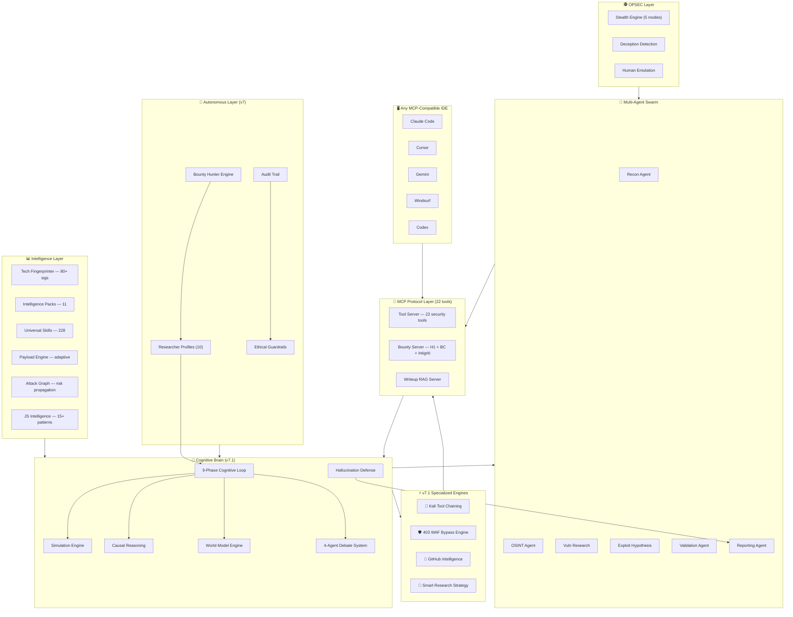

<p align="center">
  
  
  
  
  
  
  
</p>

<h1 align="center">👁️‍🗨️ THENOTHING</h1>
<h3 align="center">Cognitive Autonomous Red Team Platform</h3>

<p align="center">
  <b>The most advanced open-source AI-native offensive security research platform.</b><br/>
  22 cognitive subsystems · 228 attack skills · 10 researcher profiles · Kali-native tool chaining ·<br/>
  Advanced 403 WAF bypass · GitHub intelligence · Smart research strategy · Multi-agent swarm
</p>

<p align="center">
  THENOTHING doesn't just scan — it <b>reasons</b>, <b>simulates</b>, <b>hunts</b>, <b>debates</b>, <b>validates</b>, and <b>learns</b>.<br/>
  An autonomous cognitive red team that thinks several steps ahead.
</p>

---

## 🧠 What is THENOTHING?

THENOTHING is an **autonomous AI-native offensive security research platform** built for elite bug bounty hunters and red team operators. It operates as a cognitive red team — reasoning through a 9-phase loop, chaining Kali Linux tools intelligently, bypassing WAFs systematically, and building exploit chains that connect findings into high-impact attack scenarios.

**Key differentiators:**
- 🧠 **Cognitive reasoning** — not a scanner, but a thinking attacker
- 🐧 **Kali-native** — chains subfinder, nuclei, ffuf, sqlmap, and 18+ tools automatically
- 🛡️ **403 WAF bypass engine** — systematic path/method/header/encoding bypass testing
- 🐙 **GitHub intelligence** — hunts leaked keys, credentials, and internal tools
- 🎯 **Smart strategy** — adapts approach based on target type (API, WordPress, Cloud, K8s)
- ⚔️ **4-agent debate** — adversarial validation eliminates false positives
- 📋 **Full explainability** — immutable audit trail for every decision

---

## 🆕 What's New in v7.1

| Engine | Description |
|--------|-------------|
| 🐧 **Kali Linux Tool Integration** | Full access to all Kali tools with intelligent chaining — automatically selects and sequences the best tools for each target |
| 🛡️ **Advanced 403 WAF Bypass** | Systematic bypass testing: path manipulation, HTTP method bypass, header injection, host header override, encoding tricks, root-only protection detection |
| 🐙 **GitHub Intelligence Engine** | Proactively hunts leaked keys, credentials, internal tools, and scripts; discovers new open-source tools to enhance research |
| 🎯 **Smart Research Strategy** | Adapts methodology based on target type — API, Web App, Cloud, Kubernetes, WordPress, CDN — thinking several steps ahead |
| 🎯 **Autonomous Bounty Hunter** | Crawls HackerOne/Bugcrowd, scores programs (5-factor analysis), auto-selects targets, launches hunting campaigns |
| 🎭 **Researcher Profile Engine** | 10 dynamic personas (Stealth, Aggressive, Cloud, API, Business Logic, Exploit Chain, Mobile, Web3, Recon, Balanced) with auto-switching |
| 📋 **Explainability & Audit Layer** | Immutable chain-of-thought logging, evidence chains, confidence tracking, exportable audit trails (JSON + Markdown) |
| 🔒 **Ethical Guardrails Engine** | Scope enforcement, blast radius control, absolute safety prohibitions, justification chains for all actions |
| 🧠 **9-Phase Cognitive Loop** | Observe → Understand → Reason → Simulate → Plan → Execute → Validate → Learn → Replan |
| 🔮 **Environment Simulator** | Pre-execution attack simulation with WAF/IDS defense modeling, feasibility forecasting, risk/reward scoring |
| ⚔️ **4-Agent Debate System** | Hypothesis + Skeptic + Validator + Risk agents with weighted scoring — eliminates false positives |
| 🕵️ **Stealth OPSEC Engine** | 5 stealth modes (Ghost→Aggressive), adaptive WAF/IDS evasion, human-like timing, header rotation |

---

## ⚡ Quick Start

```bash
# Clone and setup (Linux/macOS/Kali)
git clone https://github.com/thenothing0/THENOTHING.git && cd THENOTHING && ./setup.sh

# Windows (PowerShell)
git clone https://github.com/thenothing0/THENOTHING.git; cd THENOTHING; .\setup.ps1

# Docker (production stack)
docker compose up -d

# Verify tools
python -m hydra.main --check-tools
```

### 🚀 Run Your First Hunt

```bash
# ── v7.1 Flagship — Autonomous bounty hunting campaign ──
python -m hydra.main -t example.com -w bounty_hunt

# ── Cognitive autonomous pipeline (9-phase reasoning) ──
python -m hydra.main -t example.com -w cognitive_auto

# ── Quick recon (5 min) ──
python -m hydra.main -t example.com -w quick_recon

# ── Full assessment with scope enforcement ──
python -m hydra.main -t example.com -w full_bounty --scope-url https://hackerone.com/example
```

All outputs saved to `output/<target>/` → `recon/`, `osint/`, `scans/`, `reports/`, `evidence/`, `attack_graph/`, `audit/`

---

## 🏗️ Architecture


```mermaid
graph TB
    subgraph IDE["🖥️ Any MCP-Compatible IDE"]
        CC[Claude Code]
        CR[Cursor]
        GM[Gemini]
        WS[Windsurf]
        CX[Codex]
    end

    subgraph MCP["🔌 MCP Protocol Layer (22 tools)"]
        MTS["Tool Server — 22 security tools"]
        MBS["Bounty Server — H1 + BC + Intigriti"]
        MWS["Writeup RAG Server"]
    end

    subgraph BRAIN["🧠 Cognitive Brain (v7.1)"]
        CL["9-Phase Cognitive Loop"]
        WM["World Model Engine"]
        CR2["Causal Reasoning"]
        SE["Simulation Engine"]
        DE["4-Agent Debate System"]
        HD["Hallucination Defense"]
    end

    subgraph V71["⚡ v7.1 Specialized Engines"]
        KL["🐧 Kali Tool Chaining"]
        WB["🛡️ 403 WAF Bypass Engine"]
        GI["🐙 GitHub Intelligence"]
        SS["🎯 Smart Research Strategy"]
    end

    subgraph SWARM["🐝 Multi-Agent Swarm"]
        RA[Recon Agent]
        OA["OSINT Agent"]
        VR[Vuln Research]
        EH[Exploit Hypothesis]
        VA[Validation Agent]
        RP[Reporting Agent]
    end

    subgraph AUTO["🤖 Autonomous Layer (v7)"]
        BH["Bounty Hunter Engine"]
        RPE["Researcher Profiles (10)"]
        AT["Audit Trail"]
        GR["Ethical Guardrails"]
    end

    subgraph INTEL["📊 Intelligence Layer"]
        FP["Tech Fingerprinter — 80+ sigs"]
        IP["Intelligence Packs — 11"]
        SK["Universal Skills — 228"]
        PE["Payload Engine — adaptive"]
        AG["Attack Graph — risk propagation"]
        JS["JS Intelligence — 15+ patterns"]
    end

    subgraph STEALTH["🕵️ OPSEC Layer"]
        ST["Stealth Engine (5 modes)"]
        DD["Deception Detection"]
        HE["Human Emulation"]
    end

    IDE --> MCP
    MCP --> BRAIN
    CL --> SE & CR2 & WM & DE
    BRAIN --> V71
    V71 --> MCP
    BRAIN --> SWARM
    SWARM --> MCP
    AUTO --> BRAIN
    INTEL --> BRAIN
    STEALTH --> SWARM
    BH --> RPE --> CL
    HD --> RP
    AT --> GR
```

---

## 🛡️ Advanced 403 WAF Bypass Engine

When THENOTHING encounters a `403 Forbidden`, it doesn't stop — it systematically tests **7 bypass categories**:

| Category | Techniques | Example |
|----------|-----------|---------|
| **Path-based** | Path traversal, dot segments, semicolons | `/%2e/admin`, `/admin/..;/`, `/./admin` |
| **Method-based** | Alternative HTTP methods | `OPTIONS`, `PUT`, `PATCH`, `TRACE`, `HEAD` |
| **Header-based** | Forwarding headers, URL overrides | `X-Forwarded-For: 127.0.0.1`, `X-Original-URL: /admin` |
| **Host header** | Internal host bypass | `Host: localhost`, `Host: 127.0.0.1` |
| **Encoding** | URL/double/Unicode encoding | `%2fadmin`, `%252fadmin`, Unicode normalization |
| **Root-only** | Protection scope testing | Test `/` vs `/*` vs `/specific-path` |
| **CDN/Origin** | Layer inconsistency | Different responses between WAF, CDN, and origin |

Every bypass attempt documents **WAF response vs Backend response** — distinguishing real protection from misconfiguration.

---

## 🐙 GitHub Intelligence Engine

Proactive hunting for target-related intelligence on GitHub:

- **20+ secret patterns** — AWS keys, GitHub tokens, Slack webhooks, JWTs, private keys, database URLs, Stripe keys, Firebase config
- **Endpoint extraction** — API routes, GraphQL endpoints, webhooks from source code
- **Internal domain discovery** — staging/dev/internal subdomains leaked in repos
- **Employee correlation** — `employee → repository → secret → infrastructure → attack path`
- **Tool discovery** — finds new open-source tools relevant to the current target and suggests installation

---

## 🔧 Tool Palette (22 MCP Tools)

| Category | Tools |
|----------|-------|
| **Recon & Discovery** | `subfinder_scan`, `amass_enum`, `httpx_probe`, `katana_crawl`, `gau_urls`, `hakrawler_crawl`, `dnsx_resolve` |
| **Vulnerability Scanning** | `nuclei_scan`, `nuclei_scan_list`, `sqlmap_scan`, `dalfox_scan`, `gxss_check` |
| **Fuzzing** | `ffuf_fuzz`, `dirsearch_scan` |
| **Fingerprinting** | `whatweb_detect`, `wafw00f_detect`, `nmap_scan` |
| **Knowledge & Reporting** | `save_finding`, `get_findings`, `generate_report`, `full_recon`, `check_tools` |

All tools are chained intelligently by the **Smart Research Strategy** engine based on target type and detected technology stack.

---

## 📋 Workflow Templates (10)

| Workflow | Duration | Description |
|----------|----------|-------------|
| **`bounty_hunt`** | ~60 min | **v7.1 Flagship** — Autonomous program discovery → scoring → target selection → profiling → cognitive hunt → learning |
| **`cognitive_auto`** | ~45 min | 9-phase cognitive loop with simulation, debate, and continuous learning |
| `full_auto` | ~40 min | Full autonomous: OSINT → fingerprint → crawl → deep scan → validate |
| `full_bounty` | ~30 min | Complete assessment with exploit chains |
| `blackbox` | ~25 min | Black-box aggressive reconnaissance |
| `osint_recon` | ~10 min | OSINT → fingerprint → pack activation → heuristic-guided scan |
| `api_only` | ~15 min | API endpoint discovery + auth testing |
| `quick_recon` | ~5 min | Fast subdomain + tech + nuclei scan |
| `web3_audit` | ~20 min | Smart contract vulnerability analysis |
| `code_review` | ~15 min | Source code security review |

---

## 🎯 Universal Skills Engine (228 Skills)

<details>
<summary><b>17 attack categories with full coverage</b></summary>

| Category | Skills | Coverage |
|----------|--------|----------|
| **Web** | 28 | XSS (reflected/stored/DOM/blind/mutation), SQLi (error/blind/time/stacked/second-order), NoSQLi, LDAP injection, command injection, SSRF, SSTI, XXE, CSRF, path traversal, LFI/RFI, deserialization, request smuggling, HTTP desync, cache poisoning, race conditions |
| **Auth** | 23 | JWT (none/KID/JWK/confusion), OAuth (redirect/PKCE/scope/token leak), SAML (wrapping/XXE), session fixation/hijacking, MFA bypass, IDOR, privilege escalation, RBAC/ACL bypass, password reset poisoning |
| **API** | 18 | BOLA, BFLA, mass assignment, rate limit, GraphQL (introspection/depth/IDOR/batching/alias/field-suggest), gRPC reflection, SOAP injection, WebSocket hijack |
| **Cloud** | 17 | AWS (S3/IAM/Lambda/Cognito/EC2 SSRF), Azure (blob/AD/functions), GCP (buckets/Firebase/metadata) |
| **Business Logic** | 15 | Payment/refund/coupon/checkout/trial abuse, workflow state, trust boundaries, file upload bypass, 2FA bypass |
| **Frontend** | 16 | DOM XSS, CSP bypass, postMessage, service workers, React/Vue/Angular/Next.js-specific XSS, source maps |
| **CI/CD** | 14 | GitHub Actions, GitLab CI, Jenkins, dependency confusion, artifact poisoning, Terraform, PR injection |
| **Mobile** | 14 | Android/iOS storage, cert pinning, API key extraction, deep links, Electron, WebView, biometric bypass |
| **OSINT** | 16 | Subdomain takeover, ASN mapping, GitHub leaks, employee intel, DNS history, CT logs, Wayback secrets |
| **AI/LLM** | 12 | Prompt injection (direct/indirect/multimodal), RAG poisoning, memory poisoning, tool abuse, jailbreaks |
| **Misconfiguration** | 12 | Debug mode, default creds, directory listing, backup files, admin panels, security headers, exposed metrics |
| **Kubernetes** | 8 | Dashboard exposure, RBAC bypass, container escape, Docker socket, secret exposure, lateral movement |
| **Network** | 8 | DNS rebinding, CORS misconfig, subdomain takeover, TLS weakness, DNS zone transfer, email spoofing |
| **Cryptography** | 7 | Weak hashing, padding oracle, ECB detection, weak randomness, hardcoded keys, timing attacks |
| **Supply Chain** | 6 | Typosquatting, dependency confusion, lockfile injection, build script RCE, unpinned dependencies |
| **IoT** | 6 | Firmware extraction, UART/JTAG debug, MQTT/CoAP, BLE sniffing, default credentials |
| **Exploit Chains** | 8 | XSS→ATO, SSRF→Cloud, SQLi→RCE, IDOR→ATO, OAuth→ATO, CI→Production, SSTI→RCE |

Each skill includes: exploit hypotheses, payloads, validation rules, chain links, and learning metrics.

</details>

---

## 📦 Intelligence Packs (11 Built-in)

| Pack | Focus Areas | Key Checks |
|------|------------|------------|
| **WordPress** | User enum, XML-RPC brute, plugin vulns | xmlrpc, wp-json, debug.log |
| **Next.js** | SSRF, auth bypass, env exposure | `__NEXT_DATA__`, API routes, source maps |
| **GraphQL** | IDOR, injection, DoS | Introspection, GraphiQL, depth limits |
| **AWS** | SSRF to metadata, S3 misconfig | 169.254.169.254, bucket perms |
| **Laravel** | Debug RCE, deserialization | .env, Telescope, Ignition |
| **OAuth** | Redirect steal, state bypass | redirect_uri, state param |
| **Kubernetes** | Unauth API, dashboard exposure | /api/v1, privileged pods |
| **API Security** | BOLA/IDOR, mass assignment | CORS, Swagger, auth endpoints |
| **Firebase** | Unauth read/write | .json endpoint, storage bucket |
| **Supabase** | RLS bypass, anon key exposure | PostgREST, service role key |
| **Cloudflare** | Origin IP leak, WAF bypass | DNS history, direct origin |

Packs activate automatically based on **Technology Fingerprinting** (80+ Wappalyzer-style signatures).

---

## 🧠 Cognitive Subsystems (22)

<details>
<summary><b>Complete subsystem inventory</b></summary>

| Layer | Subsystem | Purpose |
|-------|-----------|---------|
| **Core** | Cognitive Loop | 9-phase autonomous reasoning engine |
| **Core** | World Model | Target environment comprehension |
| **Core** | Causal Reasoning | Counterfactual exploit hypothesis generation |
| **Core** | Simulation Engine | Pre-execution attack path forecasting |
| **Core** | Stealth Engine | OPSEC-aware adaptive pacing (5 modes) |
| **Core** | Deception Detection | Honeypot/canary scoring |
| **Core** | Hallucination Defense | Evidence verification before reporting |
| **Core** | Red Team Critic | Adversarial self-critique |
| **Core** | Debate Engine | 4-agent adversarial validation |
| **Core** | Payload Engine | Adaptive payload generation with WAF profiling |
| **Core** | Continuous Learning | Self-improving methodology |
| **Core** | Cognitive Graph | Attack surface memory graph |
| **Core** | Recon Expansion | Recursive asset discovery |
| **Core** | Temporal Intelligence | Infrastructure history tracking |
| **Core** | Human Emulation | Realistic traffic patterns |
| **Core** | Collaborative Swarm | Multi-agent coordination |
| **Autonomous** | Bounty Hunter Engine | Target discovery and campaign orchestration |
| **Autonomous** | Researcher Profiles | 10 dynamic personas with auto-switching |
| **Autonomous** | Audit Trail | Immutable chain-of-thought logging |
| **Autonomous** | Guardrails Engine | Ethical safety enforcement |
| **v7.1** | Kali Tool Integration | Intelligent Kali tool chaining |
| **v7.1** | 403 WAF Bypass Engine | Systematic WAF bypass testing |

</details>

---

## 🔌 Multi-IDE Support (MCP)

THENOTHING works with **any MCP-compatible AI coding agent**. The `mcp_server.py` exposes all 22 security tools via the Model Context Protocol.

<details>
<summary><b>Claude Code</b> (auto-detected)</summary>

```bash
cd THENOTHING && claude
# or manually:
claude mcp add hydra-security python mcp_server.py
```
</details>

<details>
<summary><b>Cursor</b></summary>

Already configured via `.cursor/mcp.json`. Open the project in Cursor and tools are available.
```json
{
  "mcpServers": {
    "hydra-security": {
      "command": "python",
      "args": ["mcp_server.py"]
    }
  }
}
```
</details>

<details>
<summary><b>Cline / Windsurf / Codex / Any MCP Client</b></summary>

```json
{
  "mcpServers": {
    "hydra-security": {
      "command": "python",
      "args": ["/path/to/THENOTHING/mcp_server.py"]
    }
  }
}
```

For HTTP-based clients: `python mcp_server.py --transport sse --port 8900`
</details>

---

## 📦 Project Structure

```
hydra/
├── main.py                        # 🚀 Entry point — HydraEngine v7.1
├── config.py                      # ⚙️  Environment-driven configuration
│
├── cognitive/                     # 🧠 9-Phase Cognitive Loop
├── world_model/                   # 🌍 Target environment modeling
├── causal/                        # 🔍 Causal reasoning engine
├── simulation/                    # 🔮 Pre-execution simulation
├── debate/                        # ⚔️  4-Agent adversarial debate
├── stealth/                       # 🕵️ Stealth OPSEC (5 modes)
├── deception/                     # 🛡️ Honeypot/canary detection
├── hallucination/                 # 🛡️ Evidence-first verification
├── red_team_critic/               # ⚔️  Adversarial self-critique
├── payload_engine/                # 💣 Adaptive payload generation
├── continuous_learning/           # 📚 Self-improvement engine
├── cognitive_graph/               # 🕸️ Attack surface memory
├── recon_expansion/               # 🔄 Recursive asset discovery
├── temporal/                      # ⏰ Infrastructure history
├── human_emulation/               # 🤖 Realistic traffic patterns
├── swarm_intelligence/            # 🐝 Collaborative swarm
│
├── bounty_hunter/                 # 🎯 Autonomous bounty campaigns
├── researcher_profiles/           # 🎭 10 dynamic personas
├── audit/                         # 📋 Immutable audit trail
├── guardrails/                    # 🔒 Ethical safety engine
│
├── swarm/                         # 🐝 Agent swarm (7 agents)
│   ├── coordinator.py             #     Orchestration engine
│   ├── recon_agent.py             #     Asset discovery
│   ├── osint_agent.py             #     Passive intelligence
│   ├── vuln_research_agent.py     #     Vulnerability research
│   ├── exploit_hypothesis_agent.py#     Attack hypothesis
│   ├── validation_agent.py        #     Finding verification
│   └── reporting_agent.py         #     Report generation
│
├── osint/                         # 🔍 OSINT (crt.sh, Shodan, Wayback)
├── fingerprint/                   # 🔬 80+ tech signatures
├── packs/                         # 📦 11 intelligence packs
├── heuristics/                    # 🧠 Bayesian reasoning
├── skills/                        # 🎯 228 attack skills
├── js_intel/                      # 📜 JavaScript analysis
├── api_security/                  # 🔐 API security agent
├── cloud_security/                # ☁️  Multi-cloud detection
├── secret_lineage/                # 🔗 Credential tracking
│
├── mcp/                           # 🔧 MCP tool server (22 tools)
├── graph/                         # 📊 Attack graph engine
├── memory/                        # 💾 Memory bus
├── scope/                         # 🎯 Scope enforcement
├── chains/                        # ⛓️  Exploit chain builder
├── hunt/                          # 🎯 Autonomous hunt loops
├── browser/                       # 🌐 Playwright intelligence
├── execution_graph/               # 🔀 DAG execution engine
├── dashboard/                     # 📈 Real-time web dashboard
└── plugins/                       # 🔌 Plugin system
```

---

## ⚙️ Configuration

| Variable | Default | Description |
|----------|---------|-------------|
| `OPENAI_API_KEY` | | OpenAI API key |
| `ANTHROPIC_API_KEY` | | Anthropic API key |
| `OLLAMA_URL` | `http://127.0.0.1:11434` | Ollama endpoint |
| `SHODAN_API_KEY` | | Shodan API key (OSINT) |
| `GITHUB_TOKEN` | | GitHub token (OSINT + Intel) |
| `ST_API_KEY` | | SecurityTrails API key |
| `CENSYS_ID` / `CENSYS_SECRET` | | Censys credentials |
| `HYDRA_MONTHLY_CAP` | `100` | Monthly AI budget (USD) |
| `HYDRA_RATE_LIMIT` | `50` | Max requests/second |

> **Note**: OSINT API keys are optional. crt.sh, Wayback Machine, and DNS work without any keys. THENOTHING operates with zero external infrastructure (no Redis, no ChromaDB required).

---

## 🐋 Deployment

```bash
# Standalone (zero external deps)
pip install -r requirements.txt
python -m hydra.main -t example.com -w cognitive_auto

# Docker Compose (full stack: Redis, ChromaDB, Prometheus, Grafana)
docker compose up -d
# Dashboard: http://localhost:8080

# Kubernetes (production)
kubectl apply -f k8s/manifests/
```

---

## 🛡️ Safety & Ethics

| Rule | Enforcement |
|------|-------------|
| No scan without scope validation | MCP layer blocks every out-of-scope target |
| No finding without evidence | Validation-first filter rejects unsupported findings |
| No hallucinated reports | Hallucination defense + 4-agent debate blocks vague claims |
| No uncontrolled execution | Security sandbox + scope policy engine + guardrails |
| No unauthorized actions | Ethical guardrails with justification chains |
| Full explainability | Immutable audit trail for every cognitive decision |
| Budget protection | Automatic model downgrading when thresholds hit |

---

## 🧪 Tests

```bash
python -m pytest tests/ -v --tb=short
```

---

## ⚠️ Legal Disclaimer

**THENOTHING is designed for authorized security testing only.**

- Only test targets within approved bug bounty program scopes
- Always verify scope before scanning
- The guardrails engine blocks out-of-scope targets, but **you are ultimately responsible**
- Unauthorized scanning is illegal and unethical

---

## 🤝 Contributing

See [CONTRIBUTING.md](CONTRIBUTING.md) for guidelines. We welcome:
- New intelligence packs (add to `hydra/packs/`)
- Attack skill contributions (add to `hydra/skills/`)
- Tool integrations (add to `TOOL_REGISTRY` in MCP server)
- Bug bounty platform adapters
- Fingerprint signatures

---

## 📜 License

MIT License — see [LICENSE](LICENSE) for details.

---

<p align="center">
  <b>Built for elite offensive security researchers, by elite offensive security researchers.</b><br/>
  <sub>THENOTHING v7.1 — Cognitive Autonomous Red Team Platform | 22 subsystems | 228 attack skills | 10 researcher profiles | 10 workflows | Kali Native</sub>
</p>
